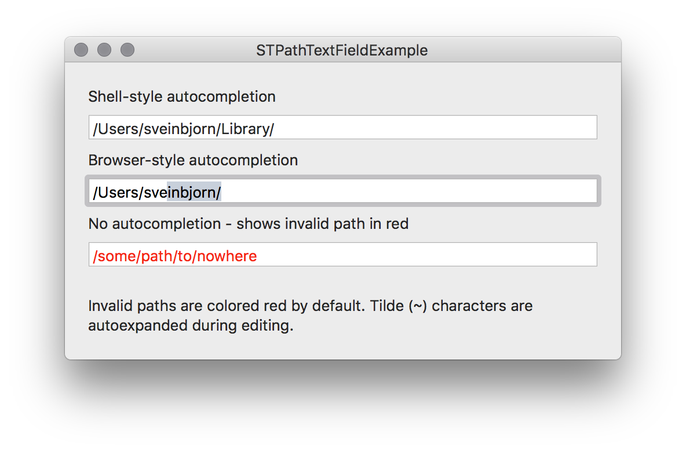

# STPathTextField - Objective C class

STPathTextField is a subclass of NSTextField for receiving and displaying a file system path.  It supports path validation and autocompletion. Autocompletion can use "web browser" style - i.e. expansion and selection, or shell autocompletion style - i.e. tab-expansion.

To use STPathTextField, just add a text field to a window in a nib file, and set its class to STPathTextField.

Default properties of an STPathTextField are the following:

```objective-c
autocompleteStyle = STNoAutocomplete;
colorInvalidPath = YES;
foldersAreValid = NO;
expandTildeInPath = YES;
```

There are three autocomplete styles:

```objective-c
typedef enum
{
    STNoAutocomplete = 0,
    STShellAutocomplete = 1,
    STBrowserAutocomplete = 2
} 
STPathTextFieldAutocompleteStyle;

```

## Screenshot of example app

